# PicConnect - Explore and connect through photography.


**Pic Connect** is a dynamic social networking app that empowers users to share their life's moments through captivating stories.

With a focus on multimedia content, users can post photos and videos, adding creative flair through tags and location data. The platform fosters a vibrant community, enabling likes, comments, and shares. Pic Connect isn't just about socializing; it's a canvas for visual storytelling.

Whether it's a dazzling sunset or an adrenaline-pumping adventure, every moment is brought to life. Join the Pic Connect community, where moments become memories and connections go beyond the screen.

This README provides a comprehensive overview of the project, its features, and the technology stack choices.

</br>

<p align="center">
  
  
  
  
</p>

## Features

PicConnect offers a wide range of features to enhance your social media experience:

- **User Authentication**: Create an account or log in securely to access all features.

- **Profile Management**: Customize your profile with a profile picture, bio, and contact information.

- **Content Sharing**: Share your favorite photos and videos with your followers.

- **Engagement**: Like, comment, and save posts. Follow other users and receive notifications.

- **Discovery**: Explore and discover new content through the Explore tab.

- **Direct Messaging**: Chat with your friends and followers through our built-in messaging system.

|  |   |  |

|  |  |

## Technology Stack

PicConnect is built using the following technologies:

- **Flutter**: We chose Flutter as the primary framework for developing PicConnect due to its cross-platform capabilities. With a single codebase, we can deploy our app on both Android and iOS, ensuring a consistent user experience across platforms.

- **Firebase**: Firebase provides a robust backend-as-a-service (BaaS) platform, which powers PicConnect's user authentication, real-time database, and cloud storage. Firebase offers seamless integration with Flutter, making it an ideal choice for building real-time and interactive features in our app.

- **Dart**: The Dart programming language is the backbone of Flutter, and we use it extensively to write clean and efficient code for our app.

 |  |

## Why Flutter and Firebase

We chose Flutter and Firebase for PicConnect for the following reasons:

- **Cross-Platform Development**: Flutter allows us to write a single codebase for both Android and iOS, reducing development time and maintenance efforts.

- **Rich User Interfaces**: Flutter's widget-based architecture makes it easy to create beautiful and responsive user interfaces, ensuring an engaging user experience.

- **Real-Time Features**: Firebase offers real-time database capabilities, making it perfect for features like real-time messaging and notifications in PicConnect.

- **Scalability**: Firebase scales effortlessly with the growth of our user base, ensuring a seamless experience for all users.

## Software Architecture

### Clean Architecture

This project adheres to the principles of **Clean Architecture**, a design approach that promotes separation of concerns and independence of layers within an application. It offers advantages such as testability, scalability, and code maintainability.

The architecture is organized into the following layers:

#### 1. Presentation Layer (UI)

- **Description**: The presentation layer handles the user interface and user interactions. In this layer, we implement the BLoC pattern to manage UI state and user actions.

- **Technology**: We leverage Flutter's capabilities to efficiently develop the presentation layer.

#### 2. Business Layer (BLoC - Business Logic Component)

- **Description**: The business layer contains application logic not directly tied to the user interface. Here, we define UseCases that encapsulate specific business requirements. These UseCases manage the application state and control data flow.

- **Technology**: In Flutter, we utilize packages like `flutter_bloc` to effectively implement BLoCs and organize business logic.

#### 3. Data Layer

- **Description**: The data layer is responsible for accessing and managing application data. It interfaces with different data sources, abstracting their implementation details. Repositories act as bridges between UseCases and data sources.

- **Technology**: We use packages like `http` for making HTTP requests and databases like SQLite or ORM packages for local storage. The use of data sources allows us to connect with Firestore and FireStorage.

#### 4. Domain Layer

- **Description**: The domain layer hosts pure business logic and application business rules. It should be isolated from specific data layer or presentation layer implementations. Here, we define the core business entities.

- **Technology**: This layer is generally free from external libraries and should remain technology-agnostic.

### UseCases, Repositories, and Data Sources

In this project, we've encapsulated business requirements in **UseCases**, which are responsible for orchestrating various operations. These UseCases interact with one or more repositories, injecting them via Inversion of Control (IoC) using GetIt.

- **UseCases**: These are the heart of the application's business logic, serving as intermediaries between the presentation and data layers. They encapsulate specific use cases, such as creating a new post, fetching user data, or handling authentication.

- **Repositories**: Repositories serve as interfaces between UseCases and data sources. They abstract the data layer's implementation, allowing us to switch between different data sources (Firestore, FireStorage, HTTP, local database) without affecting the business logic.

- **Data Sources**: Data sources manage concrete aspects of data storage. In your project, Firestore and FireStorage are the primary data sources for handling persistence. These data sources are encapsulated within repositories and accessed through well-defined interfaces.

## Advantages of Clean Architecture and Abstraction

- **Maintainability**: Clean architecture promotes separation of concerns, making it easier to maintain and update different parts of the application independently.

- **Scalability**: The architecture accommodates application growth, allowing you to extend functionality without causing major disruptions.

- **Testability**: By isolating business logic in UseCases and abstracting data sources, the codebase becomes highly testable, enabling efficient unit testing.

- **Flexibility**: The abstraction of data sources through repositories makes it possible to switch or add new data sources seamlessly, without extensive code modifications.

This architecture provides a robust foundation for your project, enabling efficient development, testing, and future expansion. It allows you to focus on implementing business logic while abstracting away the complexities of data storage and retrieval using Firestore and FireStorage.

## App Screenshots

Here are some screenshots from our app to give you a glimpse of its design and functionality.

### Onboarding Screens

|  |   | 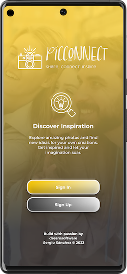 |

### Login & Registration

| 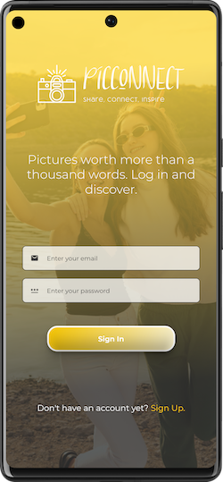 |  |  |

|  |  |  |

### Home

This section could display the main feed of posts and activities from the users you follow.

|  | 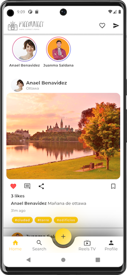 |  |

|  |  |  |

### Explore (Discover)

Here, users can search for other users, explore new popular posts, or discover interesting content.

|  |  |  |

### Explore Reels

Dive into the exciting world of Reels. Discover short and entertaining content created by people from around the world. From music videos and quick tutorials to comedy moments and more, Reels will keep you entertained for hours. Swipe up to uncover the hottest Reels and find inspiration with every scroll!

|  |  |  |

|  |  |  |


### User Profile

The user profile section is where you can view and manage your own profile. You can customize your profile picture, update your bio, and see all your posts, including photos and videos. You can also view your followers, the people you're following, and any saved posts. It's your personal space to showcase your content and connect with others in the community.

|  | 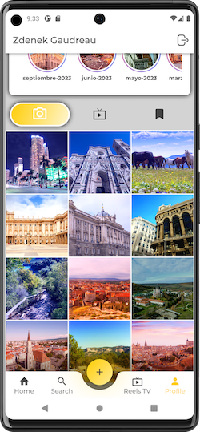 |  |

| 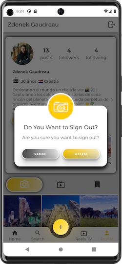 | 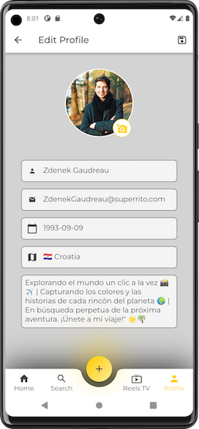 |  |

|  |  | 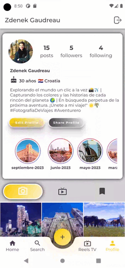


### Create Posts

This section allows you to share your moments, photos, and experiences with your followers and friends. You can upload photos and videos, add descriptions, tags, and locations so that other users can discover your posts. Share your memories and special moments with the community and stay connected with your friends through your posts!

|  |  |  |

| 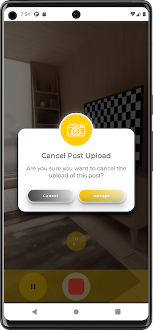 | 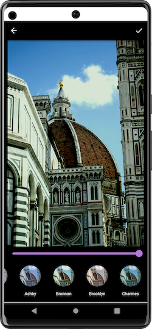 | 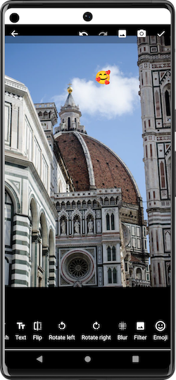 |

|  | 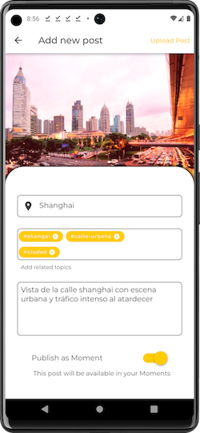 |  |

### Engaging Photography Chat 📸: Explore a Conversation on Stunning Captures!

Explore an engaging conversation about photography on PicConnect. Users share their thoughts on stunning imagery, photography tips, and locations for capturing unforgettable moments. Join this inspiring chat about the art of moment-capture.

|  |  |  |

|  |

## Dependencies

**Flutter SDK**
- **flutter:** [](https://pub.dev/packages/flutter)
- **flutter_localizations:** [](https://pub.dev/packages/flutter_localizations)
- **cupertino_icons:** [](https://pub.dev/packages/cupertino_icons)

**Firebase**
- **cloud_firestore:** [](https://pub.dev/packages/cloud_firestore)
- **firebase_auth:** [](https://pub.dev/packages/firebase_auth)
- **firebase_core:** [](https://pub.dev/packages/firebase_core)
- **firebase_storage:** [](https://pub.dev/packages/firebase_storage)

**UI**
- **flutter_staggered_grid_view:** [](https://pub.dev/packages/flutter_staggered_grid_view)
- **flutter_svg:** [](https://pub.dev/packages/flutter_svg)
- **image_picker:** [](https://pub.dev/packages/image_picker)
- **intl:** [](https://pub.dev/packages/intl)
- **provider:** [](https://pub.dev/packages/provider)
- **uuid:** [](https://pub.dev/packages/uuid)

**State Management & Dependency Injection**
- **get_it:** [](https://pub.dev/packages/get_it)
- **equatable:** [](https://pub.dev/packages/equatable)
- **flutter_bloc:** [](https://pub.dev/packages/flutter_bloc)

**Routing**
- **go_router:** [](https://pub.dev/packages/go_router)

**Functional Programming**
- **dartz:** [](https://pub.dev/packages/dartz)

**JSON Serialization**
- **json_annotation:** [](https://pub.dev/packages/json_annotation)
- **freezed_annotation:** [](https://pub.dev/packages/freezed_annotation)

**Splash Screen**
- **flutter_native_splash:** [](https://pub.dev/packages/flutter_native_splash)

**Camera**
- **camera:** [](https://pub.dev/packages/camera)

**Image Carousel**
- **carousel_slider:** [](https://pub.dev/packages/carousel_slider)

**Keyboard Visibility**
- **flutter_keyboard_visibility:** [](https://pub.dev/packages/flutter_keyboard_visibility)

**Video Player**
- **video_player:** [](https://pub.dev/packages/video_player)

**Snackbar**
- **awesome_snackbar_content:** [](https://pub.dev/packages/awesome_snackbar_content)

**Loading Spinner**
- **flutter_spinkit:** [](https://pub.dev/packages/flutter_spinkit)

**Image Viewer**
- **easy_image_viewer:** [](https://pub.dev/packages/easy_image_viewer)

**Image Editing**
- **image_editor_plus:** [](https://pub.dev/packages/image_editor_plus)

**Cached Network Images**
- **cached_network_image:** [](https://pub.dev/packages/cached_network_image)

**Stories**
- **advstory:** [](https://pub.dev/packages/advstory)

**Social Sharing**
- **share_plus:** [](https://pub.dev/packages/share_plus)

**Video Player for Chat**
- **chewie:** [](https://pub.dev/packages/chewie)

**Card Swiper**
- **card_swiper:** [](https://pub.dev/packages/card_swiper)

**Camera Awesomeness**
- **camerawesome:** [](https://pub.dev/packages/camerawesome)

**Geocoding**
- **geocoding:** [](https://pub.dev/packages/geocoding)

 **Geolocation**
- **geolocator:** [](https://pub.dev/packages/geolocator)

**Country Picker**
- **country_picker:** [](https://pub.dev/packages/country_picker)

**Video Thumbnail**
- **video_thumbnail:** [](https://pub.dev/packages/video_thumbnail)

 **Path Provider**
- **path_provider:** [](https://pub.dev/packages/path_provider)

**Visibility Detector**
- **visibility_detector:** []

## Getting Started

To get started with PicConnect, follow these steps:

1. **Clone the repository:**

```shell
  git clone https://github.com/your-username/pic-connect.git
```

2. **Install dependencies:**

```shell
  cd pic-connect
  flutter pub get
```

3. **Run the app:**

```shell
  flutter run
```

4. **Configure Firebase:**

- Create a Firebase project: [Firebase Console](https://console.firebase.google.com/)
- Add your Android and iOS apps to the Firebase project and download the configuration files (google-services.json and GoogleService-Info.plist).
- Place the configuration files in the `android/app` and `ios/Runner` directories.

5. **Set up your Firebase Realtime Database:**

- Define the database rules to secure your data.
- Initialize Firebase in your app by following the FlutterFire documentation: [FlutterFire](https://firebase.google.com/docs/flutter/setup)

## Usage

Once the app is running, you can:

- Sign up or log in to your account.
- Explore the feed to see posts from other users.
- Upload your own photos and videos.
- Follow and message other users.
- Like, comment, and save your favorite posts.

## Contributing

We welcome contributions from the community! If you'd like to contribute to PicConnect, please follow these steps:

1. Fork the repository.
2. Create a new branch for your feature or bug fix.
3. Make your changes and write tests if necessary.
4. Ensure your code passes all tests and linting rules.
5. Commit your changes with clear commit messages.
6. Push your branch to your forked repository.
7. Create a pull request to the `main` branch of the original repository.

## License

This project is licensed under the MIT License - see the [LICENSE.md](LICENSE.md) file for details.


Imagen de <a href="https://www.freepik.es/foto-gratis/mujeres-tomando-selfie-vista-frontal_32827653.htm#page=2&query=instagram%20similar&position=41&from_view=search&track=ais#position=41&page=2&query=instagram%20similar">Freepik</a>
<div> Iconos diseñados por <a href="https://www.freepik.com" title="Freepik"> Freepik </a> from <a href="https://www.flaticon.es/" title="Flaticon">www.flaticon.es'</a></div>
Imagen de <a href="https://www.freepik.es/foto-gratis/dos-amigas-sonrientes-gafas-sol-tomando-selfie-telefono-movil_3492268.htm#page=7&query=instagram%20similar&position=7&from_view=search&track=ais">Freepik</a>

Template mockup from https://previewed.app/template/AFC0B4CB

